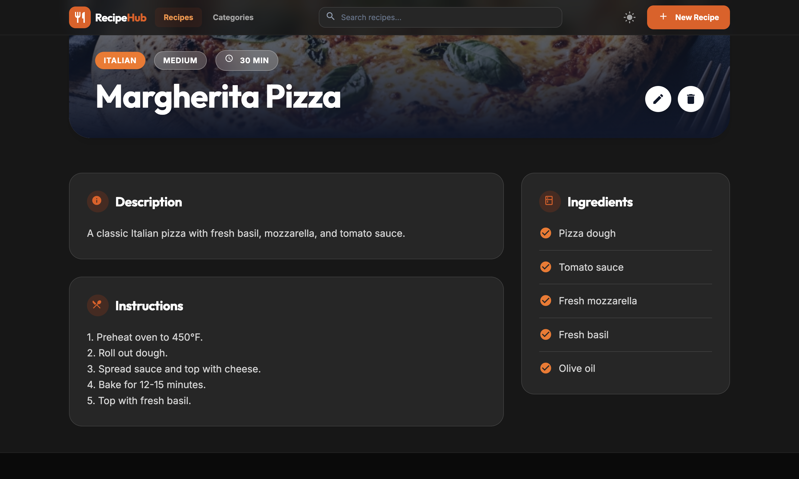

# Recipe Manager

Recipe Manager is a modern Angular application for browsing, filtering, creating, editing, and deleting recipes and categories. It is built with Angular 21, TypeScript, Tailwind CSS, Angular Material, RxJS, and SweetAlert2.

## Preview

<div align="center">
  
  
</div>


## What this app uses

- Angular standalone components
- Lazy-loaded feature routes
- Reactive forms
- Angular Material UI components
- Tailwind CSS with class-based dark mode
- RxJS for search, filtering, and API flow
- Axios-based API service wrapper
- SweetAlert2 for confirmations and alerts

## Main features

- Recipe list with search and filters
- Recipe details and recipe form pages
- Category list and category form pages
- Dark and light mode toggle
- Responsive navigation and layout
- Loading states and empty states
- Image upload support

## Project structure

- `src/app/core` - services, models, and config
- `src/app/features` - lazy-loaded recipes and categories features
- `src/app/shared` - reusable UI components such as the navbar and spinner
- `src/styles.scss` - global styling and theme overrides

## Development server

Run the app locally with:

```bash
npm start
```

Open:

```bash
http://localhost:4200/
```

The app reloads automatically when source files change.

## Build

```bash
npm run build
```

## Tests

```bash
npm test
```

## Notes

- Routes are lazy-loaded from `src/app/app.routes.ts`.
- Tailwind dark mode is controlled with the `dark` class on the root HTML element.
- API calls are centralized through `src/app/core/services/api.service.ts`.
